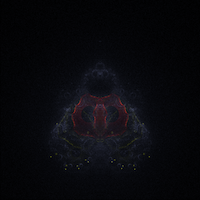
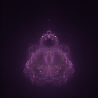

# Processing Fractals

This repository collects some fractals written in [Processing](https://processing.org/) language.

The code is not highly optimized, as the focus is on *readability* to help users understand the algorithms.

## 01.mandelbrot

### a_mandelbrot_zoom

The Mandelbrot fractal drawn pixel by pixel. Left click to **zoom in**, right click to **reset zoom**.

### b_mandelbrot_block_zoom

The Mandelbrot fractal drawn by successive refinements, that is, first in blocks of 16x16 pixels, then 8x8 pixels, etc. down to 1x1 pixel.

### b_mandelbrot_block_zoom_fancy_color

Same as ***b_mandelbrot_block_zoom***, with an alternative coloring technique.

### c_mandelbrot_julia

By clicking on a point of the Mandelbrot set, the corresponding Julia set is shown as an overlay (easier done that said :smile:)

### d_mandelbrot_block_zoom_ord3

Third order Mandelbrot set. Left click to **zoom in**, right click to **zoom out**.

## 02.buddhabrot

### a_buddhabrot

The Buddhabrot rendering algorithm discovered by Melinda Green. This implementation does not wait to end the rendering, instead it outputs trajectories on the go, giving an idea of what's going on.

Any mouse click **saves the current picture** to disk.

 An early frame of the Buddhabrot generated using  a_buddhabrot.pde

A very late frame of the Buddhabrot.

---

 This work is licensed under a <a rel="license" href="http://creativecommons.org/licenses/by-sa/4.0/">Creative Commons Attribution-ShareAlike 4.0 International License</a>.
