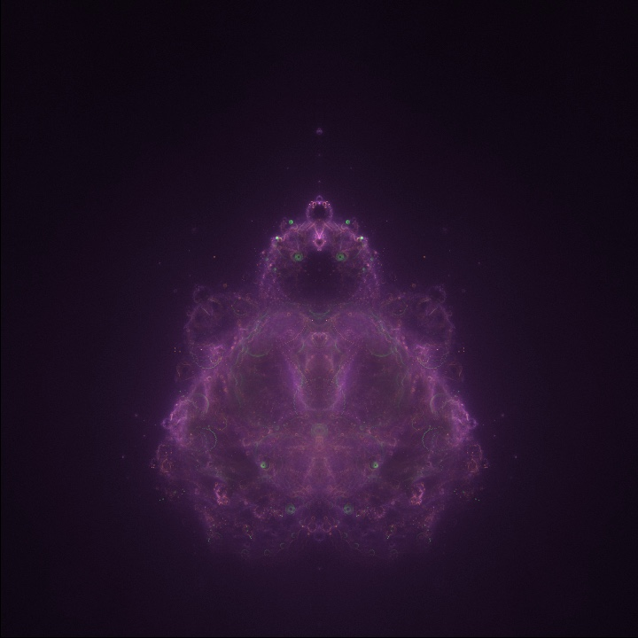

# Fractals in Processing language

Some examples of fractals written in Processing language.

## 01.mandelbrot

### a_mandelbrot_zoom

A simple Mandelbrot fractal drawn pixel by pixel. Left click to zoom, right click to reset.

### b_mandelbrot_block_zoom

The same as above, drawn by successive refinements (that is, blocks of 16x16 pixels, then 8x8, etc. down to 1x1 pixel).

### b_mandelbrot_block_zoom_fancy_color

Same as ***b_mandelbrot_block_zoom*** with alternative coloring technique.

### c_mandelbrot_julia

By clicking on a point of the Mandelbrot set, the correasponding Julia set is shown as an overlay.

### d_mandelbrot_block_zoom_ord3

Third order Mandelbrot set.

## 02.buddhabrot

### a_buddhabrot

An implementation of the Buddhabrot rendering algorithm discovered by Melinda Green.

---

 This work is licensed under a <a rel="license" href="http://creativecommons.org/licenses/by-sa/4.0/">Creative Commons Attribution-ShareAlike 4.0 International License</a>.
